[简体中文](./README.md) · [Website](https://leakmap.lei6393.com) · [GitHub](https://github.com/SuperMarioYL/leakmap)

<picture>
  <source media="(max-width: 600px) and (prefers-color-scheme: dark)" srcset="./assets/presentation/hero-mobile-dark.svg">
  <source media="(max-width: 600px)" srcset="./assets/presentation/hero-mobile-light.svg">
  <source media="(prefers-color-scheme: dark)" srcset="./assets/presentation/hero-dark.svg">
  
</picture>

# LeakMap

**Spot secret values crossing worktree boundaries.**

LeakMap indexes configured secret-bearing file patterns across Git worktrees and reports when a watched file contains a value from another worktree.

## Why use it

Parallel worktrees share a host filesystem. A source-to-target content match gives you a concrete file pair to inspect when material unexpectedly appears in another workspace.

- **Keep file provenance** — Events carry source and target paths.
- **Inspect locally** — JSONL feeds terminal, HTML and Markdown views.
- **Avoid raw event values** — Serialized events carry fields and match categories.

## Architecture

<picture>
  <source media="(max-width: 600px) and (prefers-color-scheme: dark)" srcset="./assets/presentation/architecture-mobile-dark.svg">
  <source media="(max-width: 600px)" srcset="./assets/presentation/architecture-mobile-light.svg">
  <source media="(prefers-color-scheme: dark)" srcset="./assets/presentation/architecture-dark.svg">
  
</picture>

worktree discovery enumerates roots, secret scans file patterns and builds an in-memory raw-value index, and fsnotify events feed file contents to the exact/fuzzy matcher. Events retain source and target paths without serializing raw values; renderers read JSONL into local reports.

| Component | Responsibility |
| --- | --- |
| `Worktree discovery` | internal/worktree |
| `Secret index` | internal/secret |
| `Write matcher` | internal/leak/detect.go |
| `JSONL events` | internal/leak/event.go |
| `Local reports` | internal/render |

## Install and quickstart

Use the runtime version declared in the repository manifest. The source installation below makes the included example reproducible.

```bash
git clone https://github.com/SuperMarioYL/leakmap.git
cd leakmap
go build ./cmd/leakmap
```

Run the Go example against one complete fake .env value, then compare cross-worktree and same-worktree matching.

```bash
go run ./examples/presentation
```

## Recorded demo

<picture>
  <source media="(max-width: 600px) and (prefers-color-scheme: dark)" srcset="./assets/presentation/process-mobile-dark.svg">
  <source media="(max-width: 600px)" srcset="./assets/presentation/process-mobile-light.svg">
  <source media="(prefers-color-scheme: dark)" srcset="./assets/presentation/process-dark.svg">
  
</picture>

One DB_TOKEN exact match crosses worktree-a to worktree-b; the same-worktree check yields zero events.

```text
fingerprints: 1
worktree-a -> worktree-b: field=DB_TOKEN match=exact severity=secret
same-worktree matches: 0
```

The complete command and output are recorded in [docs/demo-results.json](./docs/demo-results.json). Inputs and reproduction code are included in the repository.


The existing recording is retained for context; the text example above documents the reproducible scenario.

## Usage

Run these commands from the repository root after installation. Replace paths for your own data.

```bash
go run ./cmd/leakmap scan --repo . --json
go run ./cmd/leakmap watch --repo . --jsonl leakmap.jsonl
go run ./cmd/leakmap map --repo . --html leakmap.html
go run ./cmd/leakmap report --repo . -m REPORT.md
```

## Configuration

--repo chooses the Git repository, --jsonl the event file, and --verbose diagnostic output. The watch command's --tui renders the leak-map TUI accumulated during the session right after Ctrl-C. Scan patterns include .env variants, key/PEM and credential files, while build and dependency directories are pruned. Values shorter than eight bytes are not cross-matched. Human scan output masks values; event reports still contain potentially sensitive file paths.

## Integrations and responsibilities

<picture>
  <source media="(max-width: 600px) and (prefers-color-scheme: dark)" srcset="./assets/presentation/integrations-mobile-dark.svg">
  <source media="(max-width: 600px)" srcset="./assets/presentation/integrations-mobile-light.svg">
  <source media="(prefers-color-scheme: dark)" srcset="./assets/presentation/integrations-dark.svg">
  
</picture>

Choose the input and output route that matches your workflow. The local example below exercises the stated subset.

| Route | Implemented role |
| --- | --- |
| Git worktrees | Source and target roots |
| .env / key files | Pattern-based fingerprinting |
| fsnotify | Watched file writes |
| JSONL | Path and match evidence |
| TUI / HTML / Markdown | Local inspection exports |

## Limits and next steps

- A content match is not proof of which process copied it, which agent caused it or whether it was committed. PID attribution is best-effort and can be unknown.
- The index and recursive watch are established at startup; newly created subdirectories and later secret changes may not be covered. This is detection, not an isolation or blocking boundary.
- The demo exercises scanning and matching only. It uses a fake token; no actual user secret, live watcher, network-egress or environment-read interception is tested.

Network/environment interception, model-written summaries, wider filesystem coverage and hosted retention are future directions. No team service is delivered by this repository.

## License and contributions

See [LICENSE](./LICENSE). When reporting an issue, include a minimal input, the command, and the observed output.
