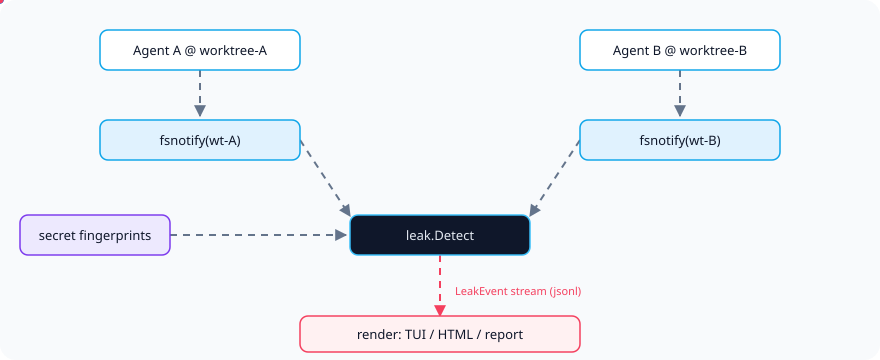
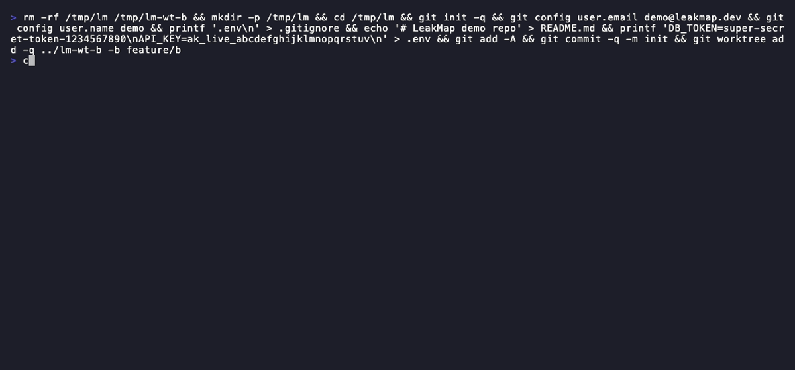

<div align="right">
  <b>English</b> | <a href="./README.md">简体中文</a>
</div>

<picture>
  <source media="(prefers-color-scheme: dark)" srcset="assets/hero-dark.svg">
  <source media="(prefers-color-scheme: light)" srcset="assets/hero-light.svg">
  
</picture>

<p align="center"><sub>The leak-map that attributes secret and file bleeds between parallel coding agents running in git worktrees of one repository.</sub></p>

<p align="center">
  <b>For the first time, cross-worktree secret bleeds between parallel agents get a real-time, attributable leak-map.</b>
</p>

<p align="center">
  <a href="./LICENSE"></a>
  <a href="https://github.com/SuperMarioYL/leakmap/releases"></a>
  <a href="https://github.com/SuperMarioYL/leakmap/actions/workflows/ci.yml"></a>
  
  
</p>

---

##  Architecture

<picture>
  <source media="(prefers-color-scheme: dark)" srcset="assets/atlas-dark.svg">
  <source media="(prefers-color-scheme: light)" srcset="assets/atlas-light.svg">
  
</picture>

One binary, one process, in-memory state. LeakMap discovers every git worktree of a repository, fingerprints each worktree's secret surface (`.env`, `*.key`, credentials), and opens an fsnotify write watch over all worktree roots. The moment a write into worktree B contains a value fingerprinted in worktree A, it emits an attributed **LeakEvent** — "Agent A's `.env` `DB_TOKEN` appears in Agent B's commit to worktree B" — written to `leakmap.jsonl` and rendered as a leak-map (TUI / local HTML / Markdown).

##  Why this exists

A git worktree is a git construct, not an isolation boundary: parallel coding agents running in several worktrees share the host's filesystem, environment variables, network egress, and build cache. A secret read by Agent A, a file written by Agent B, a token used by Agent C can all silently bleed into another worktree's run — with no audit trail.

[fletch.sh's "Git worktrees are not an isolation boundary for coding agents"](https://fletch.sh/blog/git-worktrees-vs-clones-for-ai-agents/) lays out the structural problem: today Claude Code / Cursor / Codex (and China's Trae, 通义灵码) all encourage running N parallel agent sessions across worktrees, yet cross-worktree secret bleeds are invisible and unattributed. LeakMap upgrades secret-scanning from "statically scan files" to "real-time cross-worktree attribution" — so you can finally answer "did Agent A's `.env` leak into Agent D's commit?"

<details>
<summary>How it differs from gitleaks / trufflehog</summary>

| Axis | gitleaks / trufflehog | LeakMap |
|---|---|---|
| Scope | static secret scan of one repo's files | real-time cross-worktree leak attribution |
| Timing | snapshot scan | match on write (fsnotify) |
| Attribution | none | source → target worktree + agent PID |
| Output | secret inventory | leak-map (nodes + leak edges) + JSONL audit stream |

gitleaks answers "is there a secret in this file"; LeakMap answers "who carried whose secret into whose commit" — the same secret-scan primitive, re-scoped to the inter-agent boundary.
</details>

##  Install & Quickstart

```bash
go install github.com/SuperMarioYL/leakmap@latest      # single binary, <30s
cd repo && git worktree add ../wt-b branch-b           # you already run 2+ worktrees
leakmap watch                                          # auto-discover, fingerprint, watch
```

The first leak event fires when Agent B writes Agent A's `.env` value into wt-b, landing in `leakmap.jsonl`. Cold start to first attribution is under 2 minutes.

<details>
<summary>Sample output (leakmap scan)</summary>

```
== ./lm
   agent pid: 60283
   2 secret surface entr(y|ies)
   DB_TOKEN               secret     31941df1f1b913cb  super-…7890
   API_KEY                secret     ef3531b166010dcf  ak_liv…stuv

== ../lm-wt-b
   0 secret surface entr(y|ies)
   (none)

2 worktree(s), 2 fingerprint(s)
```
</details>

##  Usage

```bash
# 1) fingerprint each worktree's secret surface, print per-worktree inventory (m1)
leakmap scan --repo .

# 2) watch cross-worktree writes, match other worktrees' fingerprints -> LeakEvent JSONL (m2)
leakmap watch --repo .

# 3) render the accumulated leak-map as a terminal TUI (nodes + leak edges)
leakmap map --repo .

# 4) render a self-contained local HTML page
leakmap map --repo . --html leakmap.html

# 5) export a Markdown leak summary (ranked by secret severity)
leakmap report --repo . -m REPORT.md
```

Subcommands and flags:

| Command | What it does |
|---|---|
| `scan [--json]` | discover worktrees, fingerprint secret files, classify (regex-first; domestic-model classification is an optional seam) |
| `watch [--jsonl PATH]` | open fsnotify cross-worktree watch, emit LeakEvent on match |
| `map [--html PATH]` | read `leakmap.jsonl`, render the leak-map (TUI or HTML) |
| `report [-m PATH] [--html PATH]` | export a Markdown (optionally HTML) summary |

Global flags: `--repo` (repo root, default `.`), `--jsonl` (audit trail path, default `leakmap.jsonl`), `-v` verbose. A full example lives at [`examples/quickstart.sh`](./examples/quickstart.sh).

##  Demo



> Recorded from [`docs/demo.tape`](./docs/demo.tape) with [vhs](https://github.com/charmbracelet/vhs). CI re-renders the gif on demand in `.github/workflows/demo.yml`.

##  Pricing / Commercial

v0.1 is a free OSS CLI — the attribution detector is free forever and runs locally. Willingness to pay emerges on top of it, in the retention and reporting layer, once DevOps / compliance writes "did an agent leak a secret across worktrees" into a checklist:

| Tier | What's included | Price |
|---|---|---|
| Free (v0.1) | local leak-map CLI + JSONL audit trail | free |
| Team (mid-term) | encrypted `leakmap.jsonl` retention (N days) + team compliance report export (SOC2-style, reusing GLM-4) + SSO | ¥99–299 / seat / month |
| Enterprise | multi-team dashboard, retention policy, SOC2 reporting | quote on request |

Benchmarked against GitGuardian internal monitoring (~$25/seat). LeakMap's detector stays free; the paid tier covers only retention and compliance reporting. No hosted SaaS of the detector — the inner circle wants local/self-hosted. Demand gate: complete 5 parallel-agent dev-team-lead interviews before LOC > 2k; if fewer than 2 confirm willingness to pay for retention/report, defer monetization.

##  Roadmap

- [x] **m1** per-worktree secret fingerprinting + classification (`leakmap scan`)
- [x] **m2** fsnotify cross-worktree write matching → LeakEvent JSONL (`leakmap watch`)
- [ ] **m3** leak-map TUI + local HTML + GLM-4 summary prose (basic TUI/HTML/Markdown shipped; model prose pending)
- [ ] **v0.2** network egress leak detection (eBPF) + real-time env-var read interception (ptrace/eBPF)
- [ ] **mid-term** audit-log retention + team compliance report + SSO (enterprise tier)
- [ ] **future** IDE plugin / editor integration, Windows support

##  Share

```
LeakMap — real-time leak-map that attributes which parallel agent's secret bled into which worktree's commit. github.com/SuperMarioYL/leakmap
```

> After pushing, set repo topics: `gh repo edit --add-topic security --add-topic secret-scanning --add-topic coding-agent --add-topic worktree`

##  License & Contributing

[MIT](./LICENSE) © 2026 SuperMarioYL. File bugs or PRs in [Issues](https://github.com/SuperMarioYL/leakmap/issues); design partners, please open an issue tagged `design-partner`.

<p align="center"><sub><a href="./LICENSE">MIT</a> © 2026 SuperMarioYL</sub></p>
